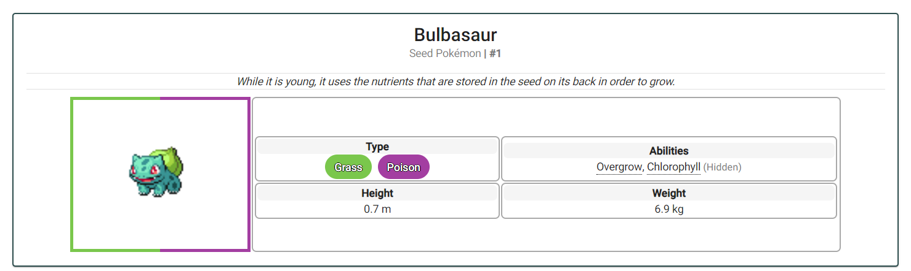

# Pokedex

A website to view details about Pokemon, built using Angular.
The goal of this project was to learn how to display data retrieved from REST API calls to the user. 

### Tools Used

- [Angular](https://angular.io/)
- [PokeAPI](https://pokeapi.co/)
- [Angular Material](https://material.angular.io/)

### Building Locally

- Install [Git](https://git-scm.com/) and [Node.js](https://nodejs.org/en/)
- Clone this repo
- Go to this repo's folder and run `npm i`
- Run `ng serve` and the site should be at *localhost:4200*.